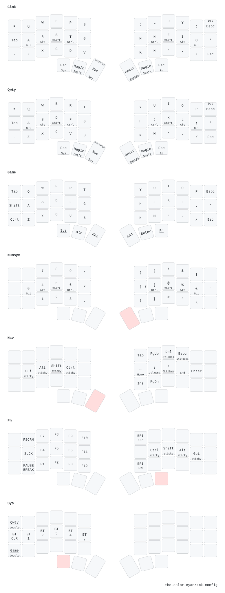

# cyan's corne zmk firmware

## external resources

- [urob's zmk-helpers](https://github.com/urob/zmk-helpers) for some helpful macros.
- [M165437's nice-view-gem](https://github.com/M165437/nice-view-gem) for some sick nice!view visuals.
- [nickcoutsos' keymap-editor](https://github.com/nickcoutsos/keymap-editor) for basic inital layer editing and planning in an easier to visualize format.
- [caksoylar's keymap-drawer](https://github.com/caksoylar/keymap-drawer) for automated keymap image visualization so I know what buttons do what.

## keymap (generated via [keymap-drawer](https://github.com/caksoylar/keymap-drawer))

## advanced functions

- [timeless home row mods](https://github.com/urob/zmk-config?tab=readme-ov-file#timeless-homerow-mods)
- hold-taps on nav layer
  - taps register as arrow keys
    - holds register as `HOME`, `END`, and `Beginning/End of document`
  - taps register as `BACKSPACE` and `DEL`
    - holds register as `Delete word backward/forward`
